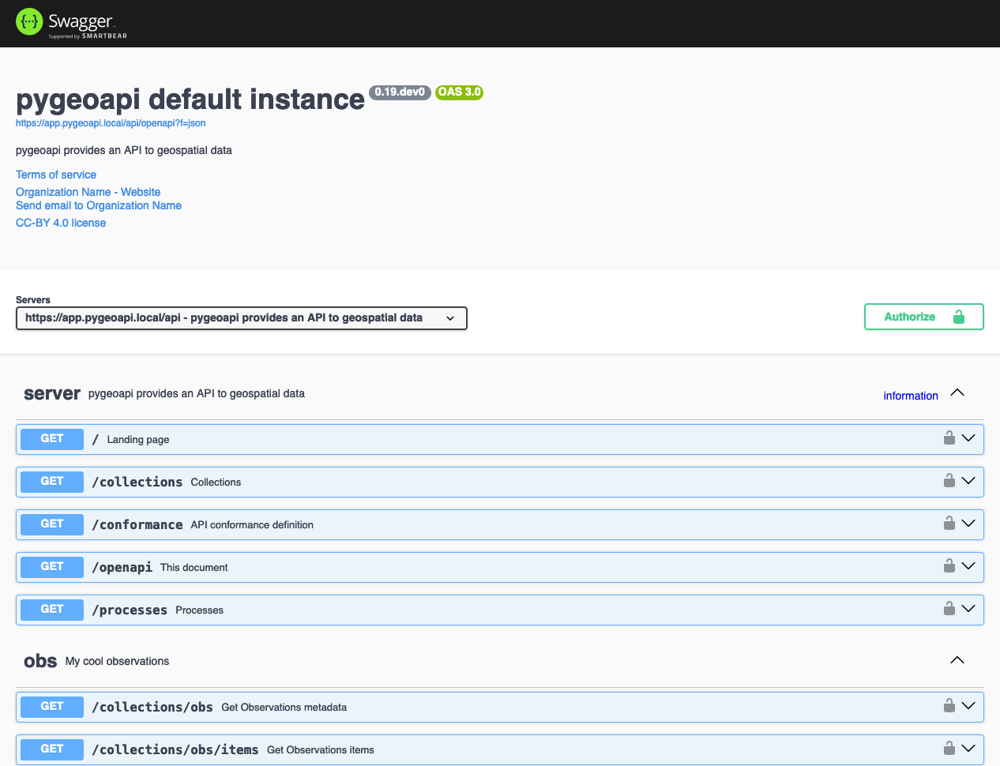
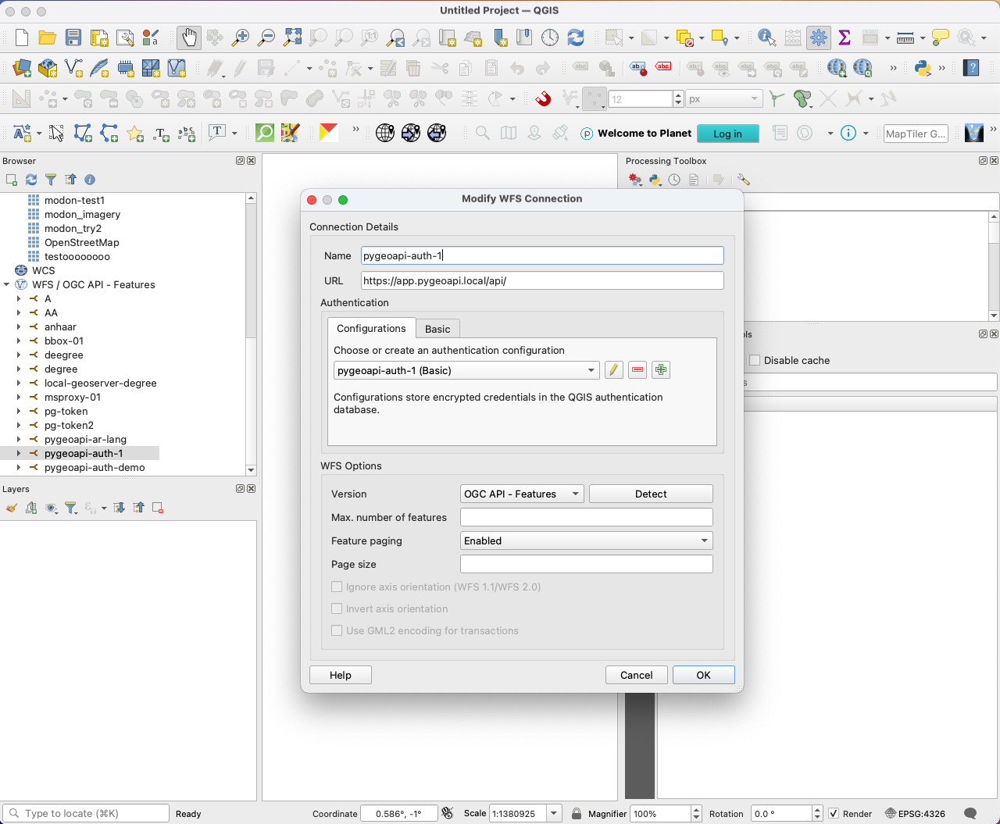
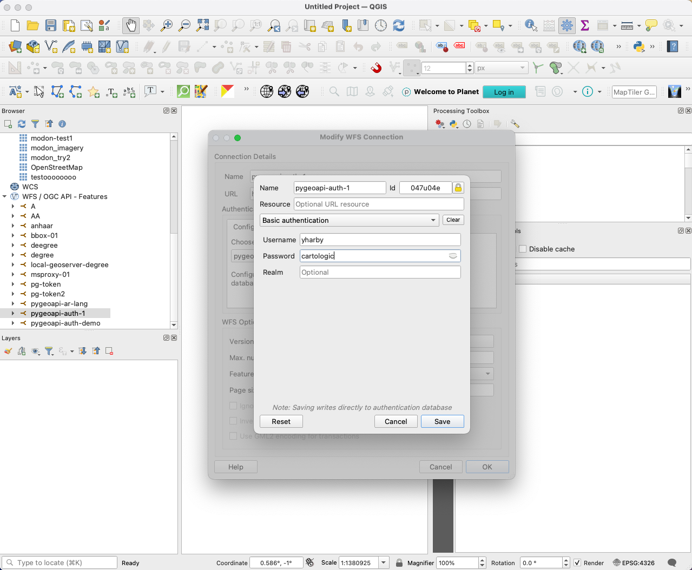

# pygeoapi-auth 🌍🔒

<p align="center">
  
</p>

> Secure your pygeoapi deployment with enterprise-grade authentication and authorization

This project provides a complete authentication and authorization solution for pygeoapi, supporting multiple deployment scenarios with Caddy or Nginx as reverse proxies, and flexible authentication backends including file-based and LDAP.

## 🌟 Features

- 🔐 Enterprise-grade authentication and authorization with Authelia
- 🚀 Multiple reverse proxy options (Caddy/Nginx)
- 📁 File-based or LDAP user management
- 🔄 Hot-reload configuration support
- 🎯 Granular access control based on user groups
- 🌐 OpenAPI specification with security schemes
- 🗺️ QGIS integration support

## 🛠️ Prerequisites

- Docker and Docker Compose
- Permission to edit `/etc/hosts` file (for local development)
- Domain with DNS A records (for production)
- SSL certificates (self-signed for development, Let's Encrypt for production)

## 🚀 Deployment Guide

### Local Development Setup

#### 1. Configure Local DNS
Add the following entries to your `/etc/hosts` file:
```bash
127.0.0.1       pygeoapi.local
127.0.0.1       app.pygeoapi.local
127.0.0.1       lldap.pygeoapi.local  # Required for LLDAP scenarios
```

#### 2. Choose Your Development Stack

##### A. Caddy with File-based Authentication
```bash
docker compose -f docker-compose-caddy.yml up -d
```
- Access the API at: https://app.pygeoapi.local/api
- Default users:
  - yharby/cartologic (cartologic group)
  - francbartoli/francbartoli (geobeyond group)

##### B. Caddy with LLDAP Integration
```bash
docker compose -f docker-compose-caddy-lldap.yml up -d
```
1. Access LLDAP admin interface: https://lldap.pygeoapi.local
2. Login with default credentials:
   - Username: admin
   - Password: super_strong_ldap_password
3. Create required groups:
   - Create group: cartologic
   - Create group: geobeyond
4. Create a test user and assign to either group
5. Access the API at: https://app.pygeoapi.local/api

##### C. Nginx with File-based Authentication
1. Generate development SSL certificates:
   ```bash
   cd nginx/certs
   openssl genpkey -algorithm RSA -out pygeoapi.key
   openssl req -new -key pygeoapi.key -out pygeoapi.csr -subj "/C=EG/ST=Cairo/L=Cairo/O=Pygeoapi/OU=IT Department/CN=*.pygeoapi.local"
   openssl x509 -req -days 365 -in pygeoapi.csr -signkey pygeoapi.key -out pygeoapi.crt
   cd ../..
   ```
2. Start services:
   ```bash
   docker compose -f docker-compose-nginx.yml up -d
   ```

##### D. Nginx with LLDAP Integration
1. Generate SSL certificates (if not done in step C)
2. Start services:
   ```bash
   docker compose -f docker-compose-nginx-lldap.yml up -d
   ```
3. Follow LLDAP setup steps from section B

### Production Deployment

#### 1. Domain and DNS Setup
1. Register a domain (e.g., pygeoapi-example.com)
2. Create A records for your subdomains:
   - app.pygeoapi-example.com
   - auth.pygeoapi-example.com
   - lldap.pygeoapi-example.com (if using LLDAP)

> **Important**: After setting up your domain, you'll need to modify the domain names in the configuration files of your chosen stack:
> - For Caddy: Update domains in `caddy/Caddyfile` or `caddy/lldap.Caddyfile`
> - For Nginx: Update server names in `nginx/site-confs/default.conf` or `nginx/site-confs-lldap/default.conf`
> - Update domain in Authelia configuration: `authelia-*/configuration.yml`
> - If using LLDAP, update LLDAP environment variables and base DN in the docker-compose file

#### 2. SSL Certificates
Choose one option:

##### Option A: Let's Encrypt (Recommended)
1. Install certbot:
   ```bash
   sudo apt install certbot
   ```
2. Obtain certificates:
   ```bash
   sudo certbot certonly --standalone -d app.pygeoapi-example.com -d auth.pygeoapi-example.com -d lldap.pygeoapi-example.com
   ```

##### Option B: Custom SSL Certificate
Use your organization's SSL certificates and place them in the appropriate directory:
- For Nginx: `nginx/certs/`
- For Caddy: Automatic HTTPS is handled by Caddy

#### 3. Choose Production Stack

##### A. Caddy (Recommended for Simplicity)
```bash
docker compose -f docker-compose-caddy.yml up -d  # File-based auth
# or
docker compose -f docker-compose-caddy-lldap.yml up -d  # LLDAP
```

##### B. Nginx (More Configuration Control)
```bash
docker compose -f docker-compose-nginx.yml up -d  # File-based auth
# or
docker compose -f docker-compose-nginx-lldap.yml up -d  # LLDAP
```

#### 4. Security Recommendations
- Use strong passwords for all services
- Enable firewall rules
- Set up monitoring and logging
- Regular security updates
- Configure rate limiting
- Use secure headers

## 🔒 Access Control

### Protected Endpoints
- `/api/collections/obs`: Requires cartologic group membership
- `/api/collections/lakes`: Requires geobeyond group membership
- `/api`: Accessible to all authenticated users

### OpenAPI Security
The OpenAPI specification is automatically injected with security schemes using [pygeoapi-auth](https://github.com/geopython/pygeoapi-auth/), which enables:
- Automatic security scheme injection into OpenAPI specification
- Swagger UI authentication support with Basic Auth
- API documentation with security requirements

The authentication injection is handled automatically by the entrypoint script using pygeoapi-auth's CLI:
```bash
pygeoapi-auth openapi inject-auth ${PYGEOAPI_OPENAPI} authelia ${PYGEOAPI_HOME}/authelia-config/configuration.yml --api-prefix api --output-file ${PYGEOAPI_OPENAPI}
```


This ensures that all API endpoints are properly documented with their security requirements and the OpenAPI specification reflects the actual authentication setup.

## 📋 Project Roadmap

### Current Features
- ✅ Basic Authentication support
- ✅ Authelia integration
- ✅ Multiple reverse proxy options (Caddy/Nginx)
- ✅ LLDAP integration
- ✅ OpenAPI specification injection
- ✅ Group-based authorization

### Planned Features
1. Authentication Enhancements
   - 🔄 OAuth2 support
   - 🔄 OpenID Connect support
   - 🔄 Multi-factor authentication (MFA)

2. Integration Expansions
   - 🔄 Additional identity providers
   - 🔄 More reverse proxy options (eg. traefik)
   - 🔄 Enhanced QGIS authentication methods
   - 🔄 ArcGIS Pro authentication methods
   - 🔄 Kubernetes deployment

3. Developer Experience
   - 🔄 Cookiecutter CLI tool
   - 🔄 Better documentation
   - 🔄 Example implementations
   - 🔄 Testing utilities

Want to contribute? Check our [issues](https://github.com/cartologic/pygeoapi-auth-deployment/issues) or submit a pull request!

## 🗺️ QGIS Integration

### Basic Authentication Setup
1. Open QGIS

2. Add new WFS / OGC API - Features connection:
   - URL: https://app.your-domain.com/api (or https://app.pygeoapi.local/api for local)
   - Authentication: Basic (or create an authentication configuration)
   - Username: (your username)
   - Password: (your password)
   
   

3. Enable "Save Username" and "Save Password" if desired
   
   

4. Test connection

### Troubleshooting QGIS Connection
- For local development: Add SSL certificate exception in QGIS
- For production: Ensure valid SSL certificate
- Verify user has access to desired collections
- Check network connectivity to pygeoapi server

## 🤝 Contributing

Contributions are welcome! Please feel free to submit a Pull Request.

## 💡 Credits

This project is inspired by [fastgeoapi](https://github.com/geobeyond/fastgeoapi) and builds upon the excellent work of the pygeoapi community.

## Bugs and Issues

All bugs, enhancements and issues are managed on [GitHub](https://github.com/cartologic/pygeoapi-auth-deployment/issues).

## Contact

* [Tom Kralidis](https://github.com/tomkralidis)
* [Youssef Harby](https://github.com/Youssef-Harby)


## 📝 License

This project is licensed under the MIT License - see the LICENSE file for details.
