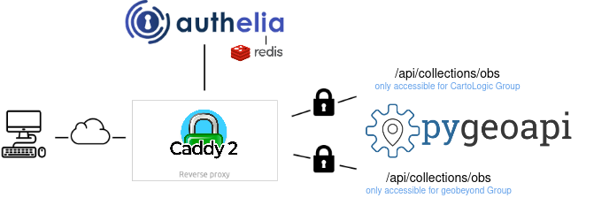

# pygeoapi-auth

<p align="center" style="margin:50px">
  
</p>

### Providing authentication and authorization for the vanilla pygeoapi. It does this by placing the `pygeoapi` behind a `Caddy` reverse proxy, which handles forward authentication and authorization with `Authelia`.

This project is a Dockerized application, and Docker Compose is used for the orchestration of the multiple services. The application's configuration is found in the `docker-compose.yml` and `Caddyfile` files.

## Pre-requisites

- Docker and Docker Compose installed on your machine.
- Permission to edit `/etc/hosts` file.

## Steps for Deployment

1. **Edit `/etc/hosts` File:**
   Add the following entries to your `/etc/hosts` file:

```bash
127.0.0.1       pygeoapi.local
127.0.0.1       app.pygeoapi.local
```

This step is necessary to resolve the local domains used in the Caddyfile or Nginx.

2. **Start the Services :**

   - ### Using Caddy

     From the root directory of the project, start all the services using Docker Compose with the following command:

     ```bash
     docker-compose up -d
     ```

   - ### Using Nginx

     From the root directory of the project, start all the services using Docker Compose with the following command:

     ```bash
     docker compose -f "docker-compose-nginx.yml" up -d
     ```

This command pulls the necessary Docker images and starts the services defined in docker-compose.yml (for Caddy) or docker-compose-nginx.yml (for Nginx).

## Testing Scenarios

For testing the deployment, you can use the following users and endpoints.

Users:

- User 1: yharby, Password: cartologic
- User 2: francbartoli, Password: francbartoli

Endpoints:

- Endpoint 1: https://app.pygeoapi.local/api/collections/obs

  Accessible by: yharby

- Endpoint 2: https://app.pygeoapi.local/api/collections/lakes

  Accessible by: francbartoli

- Endpoint 3: https://app.pygeoapi.local/api

  Accessible by: yharby and francbartoli

Please note that the password and user groups have been hashed for security reasons. The hashed passwords provided in the users_database.yml file are `cartologic` for `yharby` and `francbartoli` for `francbartoli`.

This project is inspired by the [fastgeoapi](https://github.com/geobeyond/fastgeoapi)
